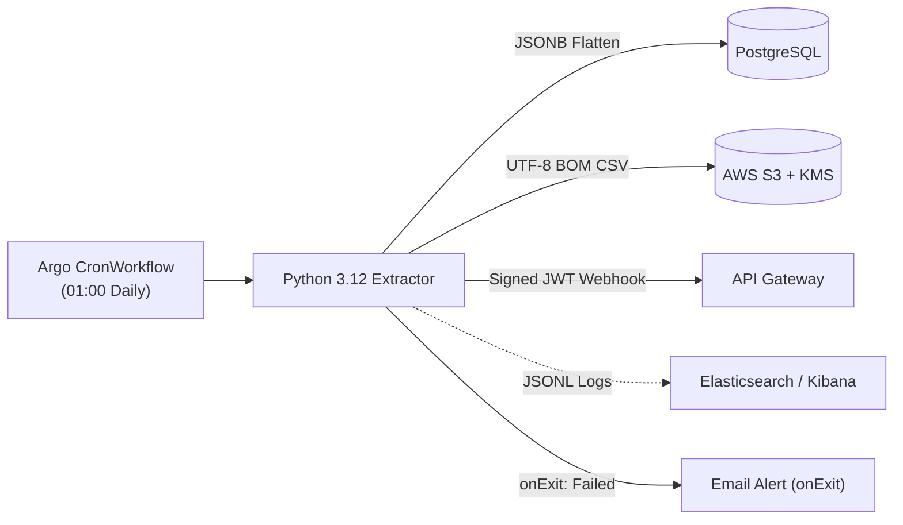

# Argo Data Pipeline & Observability (`argo-data-pipeline-monitoring`)

Production-grade Batch Data Extraction Pipeline from PostgreSQL (JSONB) to AWS S3, orchestrated by **Argo CronWorkflow** and monitored using **Kubernetes onExit Alerting** and **Elasticsearch/Kibana Structured JSON Logging**.

[](https://www.python.org/)
[](https://argoproj.github.io/workflows/)
[](https://aws.amazon.com/s3/)
[](https://www.elastic.co/kibana)

---

## 🏛️ Architecture Overview



For comprehensive technical specifications, refer to:
- [Architecture Decision Record (ADR-001)](docs/ADR-001-pipeline-observability.md)
- [System Architecture Specification](docs/ARCHITECTURE.md)
- [Observability & Monitoring Guide](docs/OBSERVABILITY_GUIDE.md)
- [Skills & Competencies Checklist](docs/SKILLS_AND_COMPETENCIES.md)

---

## 🚀 Getting Started (Local Development & Demo)

### 1. Prerequisites
- Docker & Docker Compose
- Python 3.12+

### 2. Start Local Infrastructure
Spin up local PostgreSQL (with sample JSONB events), MinIO (local S3), and MailHog (local SMTP):

```bash
docker compose up -d
```

- **PostgreSQL**: `localhost:5432` (db: `appdb`, user: `postgres`, pass: `postgrespassword`)
- **MinIO Console**: `http://localhost:9001` (user: `minioadmin`, pass: `minioadmin`)
- **MailHog Web UI**: `http://localhost:8025` (View simulated alert emails)

### 3. Run Pipeline Locally

```bash
# Setup Virtual Environment
python3 -m venv .venv
source .venv/bin/activate
pip install -r requirements.txt

# Copy configuration
cp .env.example .env

# Run Extractor
python -m src.main
```

---

## 📊 Observability Features

1. **Structured JSON Logs**: Prints single-line JSONL to stdout with operational metadata (`batch_id`, `dataset`, `stage`, `row_count`, `duration_ms`).
2. **Fail-safe Alerting**: Argo Workflow `onExit` handler intercepts container failures (including OOMKilled and timeouts) and dispatches alert emails with deep links to Kibana.

---

## 📄 License
MIT License.
