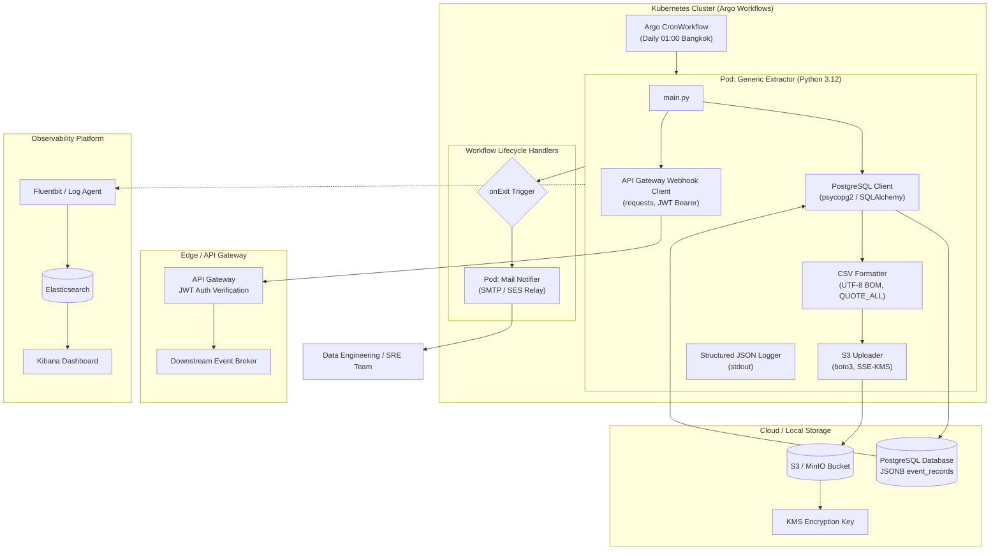
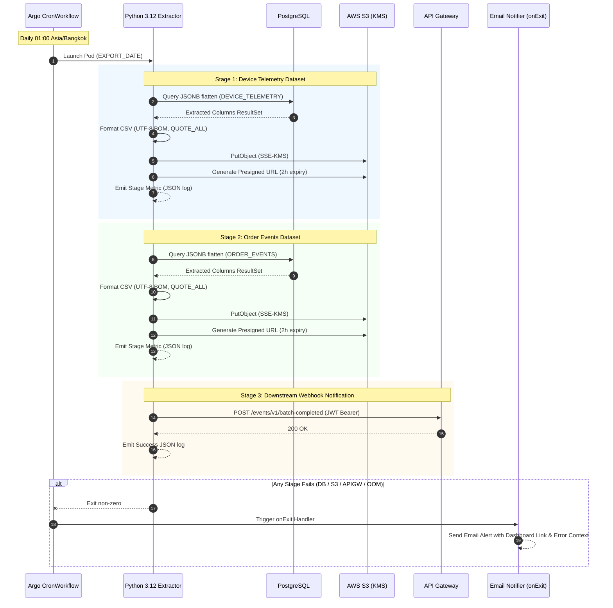

# System Architecture & Technical Specifications

This document provides a technical deep dive into the **Batch Data Pipeline & Observability** platform, designed to extract semi-structured event logs from PostgreSQL and ingest them into Cloud/Local Object Storage (S3 / MinIO).

---

## 1. High-Level Architecture

---

## 2. Sequence Flow

---

## 3. Generic Dataset Specifications

To safeguard intellectual property, this demonstration implements standardized telemetry and e-commerce models:

### Dataset 1: `DEVICE_TELEMETRY`
- **Source:** PostgreSQL table (`iot_device_events`, JSONB column: `payload`)
- **Extracted Columns:**
  1. `event_id` (UUID / String)
  2. `device_id` (String)
  3. `timestamp` (Timestamp ISO-8601)
  4. `battery_level` (Decimal)
  5. `temperature_c` (Decimal)
  6. `firmware_version` (String)
  7. `signal_strength_dbm` (Integer)
  8. `cpu_usage_pct` (Decimal)
  9. `memory_usage_pct` (Decimal)
  10. `operating_mode` (String)
  11. `network_type` (String)
  12. `ip_address` (String)
  13. `status` (String)
  14. `created_at` (Timestamp)
  15. `export_date` (Date YYYY-MM-DD)
  16. `batch_id` (String)

### Dataset 2: `ORDER_EVENTS`
- **Source:** PostgreSQL table (`store_order_events`, JSONB column: `payload`)
- **Extracted Columns:**
  1. `order_id` (String)
  2. `customer_id` (String)
  3. `event_timestamp` (Timestamp ISO-8601)
  4. `event_type` (String: CREATED, PAID, SHIPPED, CANCELLED)
  5. `currency` (String)
  6. `total_amount` (Decimal)
  7. `discount_amount` (Decimal)
  8. `item_count` (Integer)
  9. `payment_method` (String)
  10. `shipping_carrier` (String)
  11. `delivery_country` (String)
  12. `created_at` (Timestamp)
  13. `export_date` (Date YYYY-MM-DD)
  14. `batch_id` (String)

---

## 4. Security & Compliance
1. **At-Rest Encryption:** Files stored in S3 enforce server-side encryption via `aws:kms`.
2. **In-Transit Encryption:** All transport layers enforce TLS 1.3.
3. **Restricted Time-to-Live (TTL):** Presigned S3 URLs expire after 2 hours (`ExpiresIn=7200`).
4. **Data Sanitization:** Strict avoidance of proprietary corporate identifiers and business rules.
