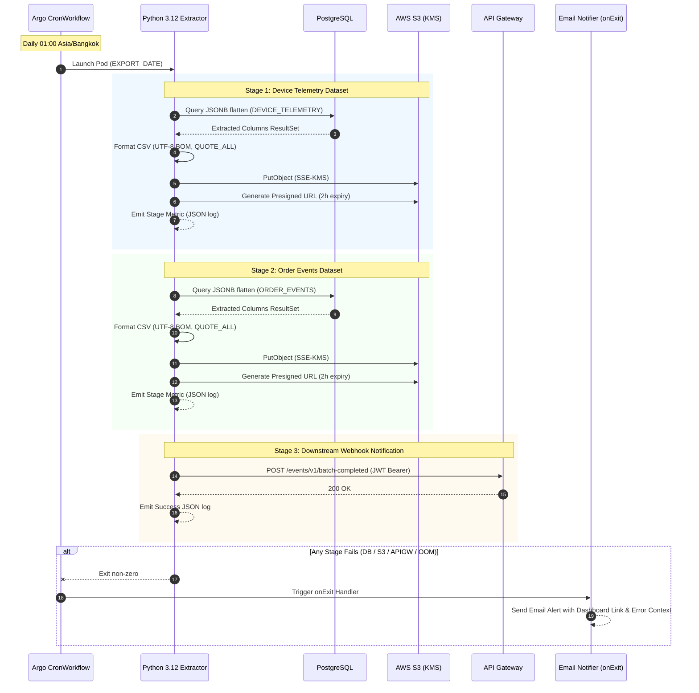

# System Architecture & Technical Specifications

เอกสารฉบับนี้อธิบายสถาปัตยกรรมเชิงลึก (Technical Deep Dive) ของระบบ **Generic Batch Data Pipeline & Observability** สำหรับสกัดข้อมูลจาก Relational Database (PostgreSQL) ไปยัง Cloud Object Storage (AWS S3)

---

## 1. High-Level Architecture

```mermaid
flowchart TD
    subgraph K8s["Kubernetes Cluster (Argo Workflows)"]
        Cron["Argo CronWorkflow<br/>(Daily 01:00 Bangkok)"]
        
        subgraph ExtractorPod["Pod: Generic Extractor (Python 3.12)"]
            Main["main.py"]
            DB["PostgreSQL Client<br/>(psycopg2 / SQLAlchemy)"]
            CSV["CSV Formatter<br/>(UTF-8 BOM, QUOTE_ALL)"]
            S3Client["S3 Uploader<br/>(boto3, SSE-KMS)"]
            Webhook["API Gateway Webhook Client<br/>(requests, JWT Bearer)"]
            LogEngine["Structured JSON Logger<br/>(stdout)"]
        end
        
        subgraph Handlers["Workflow Lifecycle Handlers"]
            OnExit{"onExit Trigger"}
            EmailPod["Pod: Mail Notifier<br/>(SMTP / SES Relay)"]
        end
    end

    subgraph Storage["AWS Cloud Services"]
        PG[(PostgreSQL Database<br/>JSONB event_records)]
        S3Bucket[("AWS S3 Bucket<br/>(SSE-KMS Encrypted)")]
        KMS["AWS KMS Key"]
    end

    subgraph Gateway["Edge / API Gateway"]
        APIGW["API Gateway (Kong / Envoy)<br/>(JWT Auth Verification)"]
        EventSink["Downstream Event Broker"]
    end

    subgraph Observability["Observability Platform"]
        Fluentbit["Fluentbit / Log Agent"]
        Elasticsearch[("Elasticsearch")]
        Kibana["Kibana Dashboard"]
    end

    %% Cron and Pipeline flow
    Cron -->|Trigger Pod| ExtractorPod
    Main --> DB
    DB -->|1. Flatten JSONB Query| PG
    PG -->|Return Rows| DB
    DB --> CSV
    CSV -->|2. Buffer / Stream CSV| S3Client
    S3Client -->|3. PutObject + KMS| S3Bucket
    S3Bucket -.->|Encrypted with| KMS
    S3Client -->|4. Generate 2h URL| S3Bucket
    Main --> Webhook
    Webhook -->|5. POST /events/v1/batch-completed<br/>(JWT)| APIGW
    APIGW -->|Forward| EventSink

    %% Logging & Observability
    ExtractorPod -.->|stdout JSON| Fluentbit
    Fluentbit --> Elasticsearch
    Elasticsearch --> Kibana

    %% Failure / Exit Handling
    ExtractorPod --> OnExit
    OnExit -->|when Failed / Errored| EmailPod
    EmailPod -->|Send Critical Alert| AlertRecipients["Data Engineering / SRE Team"]
```

---

## 2. Sequence Flow



---

## 3. Generic Dataset Specifications (Demo & Reference Domain)

เพื่อความปลอดภัยของข้อมูลองค์กร โปรเจกต์นี้ใช้โมเดลข้อมูลมาตรฐานทั่วไป (Generic E-commerce & IoT Telemetry):

### Dataset 1: `DEVICE_TELEMETRY`
- **Source:** PostgreSQL table (`iot_device_events`, JSONB column: `payload`)
- **Extracted Columns:**
  1. `event_id` (UUID / String)
  2. `device_id` (String)
  3. `timestamp` (Timestamp ISO-8601)
  4. `battery_level` (Decimal)
  5. `temperature_c` (Decimal)
  6. `firmware_version` (String)
  7. `signal_strength_dbm` (Integer)
  8. `cpu_usage_pct` (Decimal)
  9. `memory_usage_pct` (Decimal)
  10. `operating_mode` (String)
  11. `network_type` (String)
  12. `ip_address` (String)
  13. `status` (String)
  14. `created_at` (Timestamp)
  15. `export_date` (Date YYYY-MM-DD)
  16. `batch_id` (String)

### Dataset 2: `ORDER_EVENTS`
- **Source:** PostgreSQL table (`store_order_events`, JSONB column: `payload`)
- **Extracted Columns:**
  1. `order_id` (String)
  2. `customer_id` (String)
  3. `event_timestamp` (Timestamp ISO-8601)
  4. `event_type` (String: CREATED, PAID, SHIPPED, CANCELLED)
  5. `currency` (String)
  6. `total_amount` (Decimal)
  7. `discount_amount` (Decimal)
  8. `item_count` (Integer)
  9. `payment_method` (String)
  10. `shipping_carrier` (String)
  11. `delivery_country` (String)
  12. `created_at` (Timestamp)
  13. `export_date` (Date YYYY-MM-DD)
  14. `batch_id` (String)

---

## 4. Security & Compliance
1. **At-Rest Encryption:** ทุกไฟล์ที่บันทึกลง S3 ต้องระบุ Header `x-amz-server-side-encryption: aws:kms`
2. **In-Transit Encryption:** เชื่อมต่อผ่าน TLS 1.3
3. **Restricted Time-to-Live (TTL):** Presigned S3 URLs มีอายุจำกัด 2 ชั่วโมง (`ExpiresIn=7200`)
4. **Zero Proprietary Information:** ไม่มีชื่อระบบภายใน, Database names, หรือ Business logic เฉพาะขององค์กรปรากฏในโปรเจกต์
