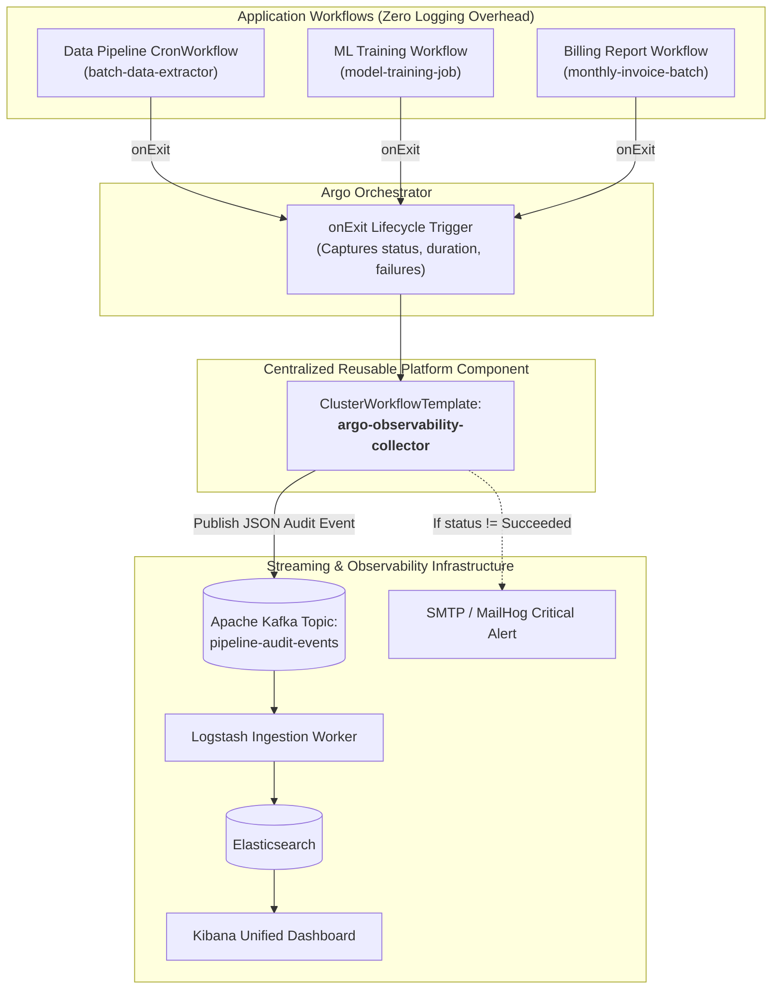

# Decoupled Observability Architecture: Orchestrator-Level onExit Collector

This architecture document specifies the **Platform Engineering** pattern where application containers remain clean and focused purely on business logic, while the **Argo Orchestration Engine (`onExit`)** intercepts execution telemetry, extracts failure contexts, formats audit events, and publishes them to **Apache Kafka** and **Elasticsearch/Kibana**.

---

## 1. Enterprise Architecture Overview



---

## 2. Key Architectural Benefits

1. **Complete Separation of Concerns (Zero Code Pollution):**
   - Application developers write pure domain code without needing Kafka clients, Elasticsearch libraries, or custom alerting code.
   - Applications do not need external network permissions to brokers.

2. **Guaranteed Failure Capture (Fail-safe):**
   - Application-level try/catch blocks fail during container `OOMKilled` (Exit 137), container eviction, or Kubernetes node faults.
   - The Argo `onExit` handler executes at the orchestration controller level, guaranteeing that audit events and error traces are captured even if the container crashes abruptly.

3. **Cluster-Wide Standardization:**
   - Any team across the organization can adopt centralized observability by adding 4 lines of YAML to their workflow's `onExit` block.

---

## 3. Reusable Template Usage Example for Any Team

Any team can integrate with this template by referencing the `argo-observability-collector`:

```yaml
apiVersion: argoproj.io/v1alpha1
kind: Workflow
metadata:
  generateName: my-team-job-
spec:
  entrypoint: main-task
  onExit: report-to-platform  # Attach onExit trigger

  templates:
    - name: main-task
      container:
        image: python:3.12-slim
        command: ["python", "app.py"]

    # Reusable Observability Step
    - name: report-to-platform
      steps:
        - - name: send-audit-telemetry
            templateRef:
              clusterScope: true
              name: argo-observability-collector
              template: publish-event
            arguments:
              parameters:
                - name: service_name
                  value: "my-custom-service"
                - name: workflow_name
                  value: "{{workflow.name}}"
                - name: status
                  value: "{{workflow.status}}"
                - name: duration
                  value: "{{workflow.duration}}"
                - name: failures
                  value: "{{workflow.failures}}"
```

---

## 4. Standardized Event Payload Schema Emitted to Kafka

```json
{
  "timestamp": "2026-09-19T01:05:23.142Z",
  "service": "batch-data-extractor",
  "workflow_name": "batch-data-extractor-cron-29381",
  "status": "Failed",
  "duration_seconds": 42,
  "failures": "run-batch-extractor.execute-pipeline failed: Container exited with code 1",
  "export_date": "2026-09-18",
  "collector": "argo-onexit-observability-collector",
  "kibana_discover_url": "https://kibana.example.com/app/discover#/?_a=(query:(language:kuery,query:'workflow_name:\"batch-data-extractor-cron-29381\"'))"
}
```
